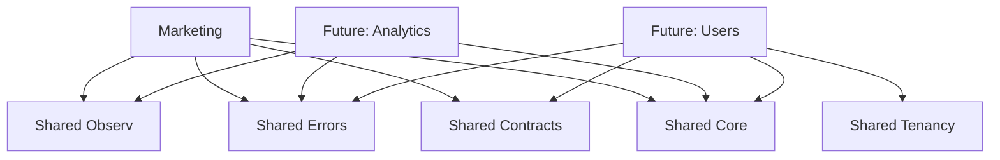

# 🧭 Cursor Context Map - Luminaris

> Mapa de navegação rápida para o agente Cursor entender contextos, dependências e documentação relevante.
> Use este arquivo como referência durante Plan Mode e implementação.

## 📋 Visão Geral dos Contextos

| Contexto | Propósito | Status | Prioridade |
|----------|-----------|--------|------------|
| **Marketing** | Landing page e conteúdo SaaS | ✅ Ativo | 🔴 Alta |
| **Shared** | Infraestrutura compartilhada | ✅ Ativo | 🟡 Média |
| **Future: Analytics** | Métricas e dashboards | 📋 Planejado | 🟢 Baixa |
| **Future: Users** | Gestão de usuários | 📋 Planejado | 🟢 Baixa |

## 🎯 Contexto: Marketing (Principal)

**Domínio**: Gerenciamento de conteúdo e apresentação da landing page SaaS

### Arquivos Principais

```
modules/marketing/
├── domain/
│   ├── entities/         # Hero, PricingPlan, Testimonial
│   ├── value-objects/    # Email, Currency, Percentage
│   ├── services/         # Domain Services (ex: pricing calculator)
│   └── ports/           # Interfaces (ContentRepository, etc.)
├── application/
│   ├── use-cases/       # compose-hero, compose-pricing, etc.
│   ├── composers/       # Composição de seções completas
│   └── dtos/            # Tipos de entrada/saída
└── infrastructure/
    ├── repos/           # Implementações de repositórios
    ├── services/        # Clientes externos (CMS, APIs)
    └── mappers/         # Conversão de dados
```

### Casos de Uso Principais

| Use Case | Arquivo | Propósito | Dependências |
|----------|---------|-----------|--------------|
| `compose-hero` | `application/use-cases/compose-hero.ts` | Monta seção Hero | ContentRepository |
| `compose-pricing` | `application/use-cases/compose-pricing.ts` | Monta planos de preço | PricingRepository |
| `compose-benefits` | `application/use-cases/compose-benefits.ts` | Monta benefícios | ContentRepository |
| `compose-faq` | `application/use-cases/compose-faq.ts` | Monta FAQ | ContentRepository |

### Documentação Relevante

- **[README.md](../modules/marketing/README.md)** - Visão geral do contexto
- **[Cenários BDD](../modules/marketing/docs/marketing.feature)** - Comportamentos esperados
- **[Vocabulário](../vocabulario.md)** - Termos de marketing (CTA, UVP, Persona)

### Dependências Externas

| Dependência | Propósito | Interface |
|-------------|-----------|-----------|
| **CMS/Content** | Dados dinâmicos | `ContentRepository` |
| **Analytics** | Rastreamento de eventos | `AnalyticsService` |
| **A/B Testing** | Experimentos | `ExperimentService` |

## 🔧 Contexto: Shared (Infraestrutura)

**Domínio**: Componentes compartilhados entre contextos

### Pacotes Principais

```
packages/
├── shared-core/         # Tipos base (Result<T>, Option, etc.)
├── shared-errors/       # AppError, Problem+JSON
├── shared-contracts/    # Schemas Zod, DTOs públicos
├── shared-config/       # Configuração ambiente
├── shared-observ/       # Logging, métricas, tracing
├── shared-tenancy/      # Multi-tenant (futuro)
├── shared-cache/        # Redis/memória cache
└── shared-events/       # Event sourcing (futuro)
```

### Interfaces Comuns

| Interface | Propósito | Implementações |
|-----------|-----------|----------------|
| `Result<T, E>` | Tratamento de erros tipado | `Ok<T>`, `Err<E>` |
| `AppError` | Hierarquia de erros | ValidationError, NotFoundError, etc. |
| `Logger` | Logs estruturados | Console, Pino, etc. |
| `Cache` | Cache distribuído | Redis, Memcached, etc. |

### Documentação Relevante

- **[Arquitetura](../architecture.md)** - Padrões de shared
- **[Qualidade](../quality.md)** - Contratos e validação
- **[ADR 001](../ADR/001-adocao-de-result-apperror.md)** - Padrão de erros

## 🔍 Navegação por Tarefa

### Quando implementar uma nova seção da landing page

1. **Verificar vocabulário**: [vocabulario.md](../vocabulario.md) para termos corretos
2. **Ler arquitetura**: [architecture.md](../architecture.md) para padrões
3. **Consultar cenários**: `modules/marketing/docs/marketing.feature`
4. **Seguir ADR**: [ADR 002](../ADR/002-adocao-clean-architecture.md)

### Quando adicionar validação/contrato

1. **Verificar contratos**: `packages/shared-contracts/`
2. **Ler ADR**: [ADR 001](../ADR/001-adocao-de-result-apperror.md)
3. **Consultar qualidade**: [quality.md](../quality.md) para testes

### Quando modificar estilos/componentes

1. **Verificar Design System**: [ADR 003](../ADR/003-adocao-design-system-unificado.md)
2. **Consultar componentes**: `components/ui/` para padrões
3. **Validar acessibilidade**: Testes WCAG

## 🧪 Testes por Contexto

| Tipo | Comando | Contexto | Arquivos |
|------|---------|----------|----------|
| Unit | `pnpm test:unit` | Todos | `**/*.test.ts` |
| Integration | `pnpm test:integration` | Marketing | `modules/marketing/**/*.integration.test.ts` |
| Contract | `pnpm test:contract` | Shared | `packages/shared-contracts/**/*.test.ts` |
| E2E | `pnpm test:e2e` | Marketing | `tests/e2e/marketing/**/*.spec.ts` |

## 📊 Métricas por Contexto

| Contexto | Cobertura Mínima | Complexidade Máxima | Arquivos |
|----------|------------------|---------------------|----------|
| Marketing | 80% | 10 | `modules/marketing/**/*.{ts,tsx}` |
| Shared | 90% | 8 | `packages/shared*/**/*.{ts,tsx}` |
| Components | 85% | 12 | `components/**/*.{ts,tsx}` |

## 🚨 Pontos de Atenção

### Marketing Context
- **Performance crítica**: LCP ≤ 2.5s, CLS ≤ 0.1
- **SEO obrigatório**: Meta tags, schema.org
- **Acessibilidade**: WCAG AA minimum
- **Mobile-first**: Responsive obrigatório

### Shared Packages
- **Backward compatibility**: Não quebrar contratos existentes
- **Versionamento**: Semantic versioning
- **Documentação**: Todos exports devem ser documentados
- **Testes**: 100% coverage nos contratos

### Componentes UI
- **Design System**: Usar apenas tokens centralizados
- **Acessibilidade**: ARIA, foco, contraste automático
- **Performance**: Lazy loading quando apropriado
- **Consistência**: Mesmo padrão em todos os componentes

## 🔗 Dependências entre Contextos



## 📚 Documentação por Tipo

| Tipo | Localização | Propósito | Atualização |
|------|-------------|-----------|-------------|
| **Arquitetura** | `docs/architecture.md` | Padrões técnicos | Mudanças estruturais |
| **Qualidade** | `docs/quality.md` | Gates e métricas | Novos requisitos |
| **BDD** | `docs/bdd.md` | Cenários e testes | Novos comportamentos |
| **Vocabulário** | `docs/vocabulario.md` | Termos DDD | Novos conceitos |
| **Comandos** | `docs/COMMANDS.md` | CLI reference | Novos scripts |
| **Troubleshooting** | `docs/troubleshooting.md` | Problemas comuns | Novos bugs |
| **ADR** | `docs/ADR/` | Decisões arquiteturais | Mudanças importantes |

## 🎯 Próximos Contextos Planejados

### Analytics (Q2 2025)
- **Métricas de conversão**: CTA clicks, form submissions
- **A/B testing**: Experimentos de otimização
- **Heatmaps**: Análise de engajamento
- **Attribution**: Rastreamento de fonte

### Users (Q3 2025)
- **Autenticação**: Login/signup com provedores
- **Perfis**: Dados do usuário e preferências
- **Onboarding**: Fluxo de primeiro acesso
- **Permissions**: Controle de acesso baseado em plano

---

**💡 Dica para o Cursor**: Use este mapa como "índice" durante Plan Mode. Para implementar algo novo, primeiro localize o contexto relevante, depois consulte a documentação específica e siga os padrões estabelecidos nos ADRs.
