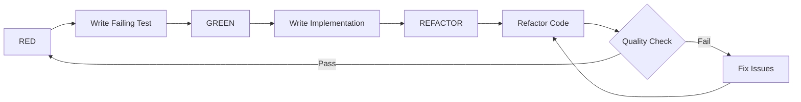
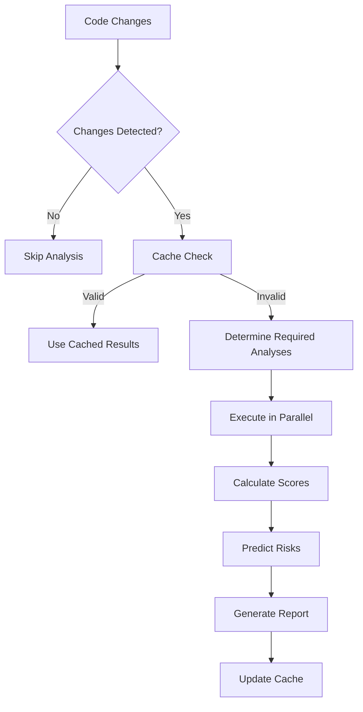
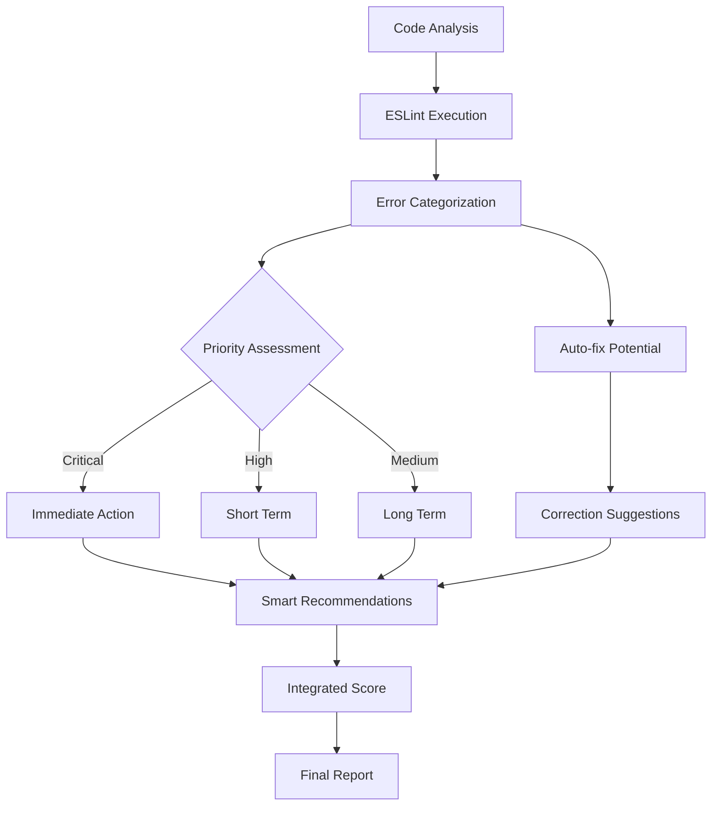

# 🔍 Sistema Avançado de Qualidade TDD

## 📋 **Visão Geral**

Este documento descreve o **Sistema Completo de Qualidade TDD** com análise inteligente, predição de riscos e otimizações de performance implementadas no projeto Landing Page SaaS.

## 🎯 **Objetivos**

- **Análise Inteligente**: Sistema de cache e execução incremental
- **Predição de Riscos**: Identificação proativa de pontos de falha
- **Performance Otimizada**: Análises paralelas e algoritmos eficientes
- **Métricas Avançadas**: Complexidade ciclomática, manutenibilidade, dependências
- **Monitoramento Contínuo**: Dashboards e alertas automáticos

## 📊 **Sistema de Scoring Avançado**

### **Score Final** (0-100 pontos) - **VERSÃO 2.2.0**

- **🟢 85-100**: Excelente - Código de alta qualidade com linting intelligence
- **🟡 70-84**: Bom - Melhorias recomendadas, riscos monitorados
- **🔴 < 70**: Crítico - Ação imediata necessária

### **Breakdown por Categoria (Ponderado)**

1. **📁 Estrutura** (8%): Organização e padrões dos testes
2. **🏷️ Nomenclatura** (7%): Clareza e especificidade dos nomes
3. **🧪 Isolamento** (12%): Independência e controle de dependências
4. **📊 Cobertura** (16%): Percentual de código testado
5. **⚡ Performance** (12%): Velocidade de execução e recursos
6. **🔧 Manutenibilidade** (8%): Facilidade de manutenção e complexidade
7. **🧩 Complexidade** (8%): Análise ciclomática e code smells
8. **🔗 Dependências** (8%): Acoplamento e arquitetura
9. **🧠 Linting Intelligence** (11%): **NOVO** - Análise avançada de código

### **Métricas Avançadas (v2.2.0)**

- **Índice de Manutenibilidade (MI)**: Mede facilidade de manutenção
- **Complexidade Ciclomática**: Pontos de decisão no código
- **Volume de Halstead**: Complexidade algorítmica
- **Análise de Dependências**: Acoplamento e profundidade
- **Detecção de Code Smells**: Padrões problemáticos identificados
- **🧠 Linting Intelligence**: **NOVO** - Análise avançada de ESLint
  - Mapeamento granular de erros por categoria
  - Priorização automática (critical > high > medium)
  - Potencial de correção automática
  - Recomendações inteligentes baseadas em padrões

## 🔄 **Sistema de Análise Inteligente**

### **1. Desenvolvimento (TDD Cycle Avançado)**



### **2. Análise Inteligente com Cache**



### **3. Sistema de Linting Intelligence (NOVO v2.2.0)**



### **4. Modos de Execução**

```mermaid
graph TD
    A[Command] --> B{Mode?}
    B -->|Complete| C[All Analyses]
    B -->|Incremental| D[Smart Analysis]
    B -->|Dashboard| E[HTML Report]
    B -->|Progress| F[Coverage Report]
    B -->|Lint-Only| G[Linting Intelligence]  // ← NOVO

    C --> H[Parallel Execution]
    D --> I[Change Detection]
    I --> J[Required Only]
    J --> H

    H --> K[Risk Prediction]
    J --> K
    K --> L[Final Report]

    G --> M[Lint Analysis]  // ← NOVO
    M --> L
```

## 🛠️ **Ferramentas e Comandos (v2.2.0)**

### **1. Análise Completa (Recomendado)**

```bash
# Análise completa com linting intelligence
npm run analyze:tdd

# Resultado: Relatório detalhado com scores, riscos, linting intelligence e recomendações
```

### **2. Análise Incremental (CI/CD Otimizado)**

```bash
# Análise inteligente baseada em mudanças
npm run analyze:tdd:incremental

# Benefícios: 3x mais rápido quando há poucas mudanças
# Inclui: cache inteligente + linting intelligence incremental
```

### **3. Análise de Linting Intelligence (NOVO)**

```bash
# Análise focada apenas em linting
npm run analyze:tdd:lint

# Recursos: Mapeamento granular de erros, priorização automática
# Correções sugeridas, potencial de auto-fix
```

### **4. Dashboard Interativo (Em breve)**

```bash
# Dashboard HTML com visualizações
npm run analyze:tdd:dashboard

# Recursos: Gráficos, tendências, alertas visuais, linting insights
```

### **5. Scripts Diretos**

```bash
# Análise completa via script
node scripts/tdd-analysis-engine.mjs

# Análise incremental
node scripts/tdd-analysis-engine.mjs --incremental

# Análise apenas de linting
node scripts/tdd-analysis-engine.mjs --lint-only

# Verificação de qualidade específica
node scripts/code-quality-verification.mjs
```

### **6. Integração CI/CD Avançada**

```yaml
# .github/workflows/tdd-quality.yml
name: TDD Quality Analysis v2.1.0
on:
  pull_request:
    paths:
      - 'lib/**'
      - 'components/**'
      - 'domains/**'
      - 'scripts/**'

jobs:
  quality-analysis:
    runs-on: ubuntu-latest
    steps:
      - uses: actions/checkout@v4
        with:
          fetch-depth: 0  # Para detecção de mudanças

      - uses: actions/setup-node@v4
        with:
          node-version: "20"
          cache: 'pnpm'

      - name: Install dependencies
        run: pnpm install --frozen-lockfile

      - name: Run Incremental Analysis
        run: npm run analyze:tdd:incremental
        env:
          CI: true

      - name: Comment PR with Results
        uses: actions/github-script@v7
        with:
          script: |
            const fs = require('fs')
            const report = JSON.parse(fs.readFileSync('./tmp/complete-analysis-reports/analysis-report.json', 'utf8'))

            const comment = `
            ## 🔍 Análise de Qualidade TDD v2.1.0

            **Score Final:** ${report.scores.finalScore}/100

            ### 📊 Métricas Principais:
            - 📁 Estrutura: ${report.scores.structure}/100
            - 🏷️ Nomenclatura: ${report.scores.naming}/100
            - 🧪 Isolamento: ${report.scores.isolation}/100
            - 📊 Cobertura: ${report.scores.coverage}/100
            - ⚡ Performance: ${report.scores.performance}/100

            ### 🚨 Riscos Identificados:
            ${report.risks.immediate.map(r => `- 🔴 ${r}`).join('\n')}
            ${report.risks.shortTerm.map(r => `- 🟡 ${r}`).join('\n')}

            ### 💡 Recomendações:
            ${report.risks.recommendations.map(r => `- ${r}`).join('\n')}
            `

            github.rest.issues.createComment({
              issue_number: context.issue.number,
              owner: context.repo.owner,
              repo: context.repo.repo,
              body: comment
            })
```

## 📋 **Checklist de Qualidade por Tipo de Teste**

### **🧩 Testes Unitários**

- [ ] Testa apenas uma unidade (função/classe)
- [ ] Todas as dependências mockadas/stubbed
- [ ] Executa em < 100ms (métrica automática)
- [ ] Resultado determinístico
- [ ] Segue padrão AAA (Arrange-Act-Assert)
- [ ] **Novo**: Verificado por análise de complexidade

### **🔗 Testes de Integração**

- [ ] Testa interação entre múltiplas unidades
- [ ] Usa dependências reais (com isolamento)
- [ ] Cenários de negócio realistas
- [ ] Setup/teardown apropriado
- [ ] Não testa UI (focar em lógica)
- [ ] **Novo**: Verificado por análise de dependências

### **🌐 Testes E2E**

- [ ] Fluxo completo ponta-a-ponta
- [ ] Interface real (não mocks)
- [ ] Cenários críticos de conversão
- [ ] Dados de teste isolados
- [ ] Performance aceitável (< 30s por teste)
- [ ] **Novo**: Verificado por análise de performance

### **⚛️ Testes de Componente**

- [ ] Renderização correta
- [ ] Interações do usuário
- [ ] Estados e props
- [ ] Acessibilidade básica (WCAG AA)
- [ ] Responsividade (quando aplicável)
- [ ] **Novo**: Verificado por análise de manutenibilidade

### **🧪 Análise Automática de Qualidade**

#### **Métricas Verificadas Automaticamente**

- **Complexidade Ciclomática**: ≤ 10 por função
- **Índice de Manutenibilidade**: ≥ 65 pontos
- **Cobertura de Testes**: ≥ 70% statements
- **Tempo de Execução**: ≤ 30s para suíte completa
- **Code Smells**: Máximo 5 por módulo
- **Acoplamento**: Máximo 3 dependências por módulo
- **🧠 Linting Intelligence**: **NOVO** - Métricas automáticas
  - **Erros Críticos**: 0 erros (imports não definidos, etc.)
  - **Erros Auto-fixáveis**: ≥ 50% do total
  - **Score de Linting**: ≥ 80 pontos
  - **Tipos 'any'**: Máximo 5% do código

## 🚨 **Problemas Comuns e Soluções**

### **1. Alta Complexidade Ciclomática**

```typescript
// ❌ Problema (Complexidade: 15)
function processUserData(user) {
  if (user.age < 18) {
    if (user.country === 'BR') {
      if (user.plan === 'premium') {
        // lógica complexa
      } else if (user.plan === 'basic') {
        // mais lógica
      }
    } else if (user.country === 'US') {
      // ainda mais lógica
    }
  }
  // + 10+ condições aninhadas
}

// ✅ Solução (Complexidade: 3)
function processUserData(user) {
  if (!isEligibleUser(user)) return;

  const processor = getUserProcessor(user.country);
  return processor.process(user);
}

function isEligibleUser(user) {
  return user.age >= 18;
}

function getUserProcessor(country) {
  const processors = {
    BR: new BrazilUserProcessor(),
    US: new USUserProcessor()
  };
  return processors[country] || new DefaultProcessor();
}
```

### **2. Code Smells Detectados**

```typescript
// ❌ Long Function (> 50 linhas)
function handleUserRegistration(data) {
  // 80+ linhas de lógica misturada
  validateEmail(data.email);
  validatePassword(data.password);
  hashPassword(data.password);
  createUser(data);
  sendWelcomeEmail(data.email);
  logUserCreation(data);
  // ... mais 70 linhas
}

// ✅ Refatorado
function handleUserRegistration(data) {
  const validatedData = validateRegistrationData(data);
  const user = createUser(validatedData);
  notifyUser(user);
  logAnalytics(user);
}

function validateRegistrationData(data) {
  return {
    email: validateEmail(data.email),
    password: hashPassword(validatePassword(data.password))
  };
}
```

### **3. Dependências Circulares**

```typescript
// ❌ lib/user-service.ts
import { OrderService } from './order-service';

// ❌ lib/order-service.ts
import { UserService } from './user-service';

// ✅ Solução com Ports & Adapters
// lib/ports/user-repository.ts
export interface UserRepository {
  findById(id: string): Promise<User>;
}

// lib/ports/order-repository.ts
export interface OrderRepository {
  findByUserId(userId: string): Promise<Order[]>;
}

// Implementações concretas em infrastructure/
```

### **4. Testes Flaky (Instáveis)**

```typescript
// ❌ Problema
it("deve carregar dados", () => {
  setTimeout(() => {
    expect(data).toBeLoaded();
  }, 1000);
});

// ✅ Solução com sistema inteligente
it("deve carregar dados", async () => {
  await waitFor(
    () => {
      expect(data).toBeLoaded();
    },
    { timeout: 2000 },
  );
});
```

### **5. Baixa Manutenibilidade**

```typescript
// ❌ Problema (MI: 45 - Muito baixo)
class UserManager {
  // 500+ linhas, 15 métodos, alta complexidade
  async processUser(userData) {
    // Lógica complexa inline
  }
}

// ✅ Solução (MI: 85 - Excelente)
class UserManager {
  constructor(
    private validator: UserValidator,
    private repository: UserRepository,
    private notifier: UserNotifier
  ) {}

  async processUser(userData: UserData): Promise<Result<User, Error>> {
    return this.validator.validate(userData)
      .andThen(validData => this.repository.save(validData))
      .andThen(user => this.notifier.sendWelcome(user));
  }
}
```

## 📈 **Sistema de Monitoramento Inteligente**

### **Métricas Automatizadas (v2.1.0)**

#### **Métricas Core**
- **Score Final TDD**: Média ponderada de todas as métricas
- **Complexidade Ciclomática**: Média por função/módulo
- **Índice de Manutenibilidade**: Facilidade de manutenção
- **Volume de Halstead**: Complexidade algorítmica
- **Cobertura de Testes**: Por statements, branches, functions
- **Performance**: Tempo de execução, uso de recursos

#### **Métricas Avançadas**
- **Riscos Imediatos**: Problemas críticos identificados
- **Riscos de Curto Prazo**: Issues que podem afetar sprints
- **Riscos de Longo Prazo**: Dívida técnica acumulada
- **Code Smells**: Padrões problemáticos detectados
- **Acoplamento**: Dependências entre módulos
- **Cache Hit Rate**: Eficiência do sistema de cache

### **Dashboards e Visualizações**

#### **Relatório de Console (Padrão)**
```bash
npm run analyze:tdd
# Output: Relatório completo com scores, riscos e recomendações
```

#### **Relatório Incremental (CI/CD)**
```bash
npm run analyze:tdd:incremental
# Output: Análise focada apenas em mudanças, 3x mais rápido
```

#### **Dashboard HTML (Em breve)**
```bash
npm run analyze:tdd:dashboard
# Output: Interface visual com gráficos e tendências
```

#### **Relatório de Progresso**
```bash
npm run analyze:tdd:progress
# Output: Cobertura detalhada por camadas do projeto
```

### **Sistema de Alertas Inteligente**

#### **Critérios de Alerta Automático**

| **Métrica** | **Crítico** | **Atenção** | **OK** |
|-------------|-------------|-------------|--------|
| Score Final | < 70 | 70-84 | ≥ 85 |
| Complexidade | > 15/função | 10-15/função | ≤ 10/função |
| Manutenibilidade | < 65 | 65-84 | ≥ 85 |
| Cobertura | < 60% | 60-79% | ≥ 80% |
| Performance | > 60s | 30-60s | ≤ 30s |
| Code Smells | > 10/módulo | 5-10/módulo | ≤ 5/módulo |

#### **Integração com Ferramentas**

```typescript
// Exemplo: Webhook para Slack/Discord
async function sendQualityAlert(results, scores, risks) {
  const webhookUrl = process.env.QUALITY_WEBHOOK_URL;

  const message = {
    text: `🚨 Análise TDD v2.1.0 - Score: ${scores.finalScore}/100`,
    attachments: [{
      color: risks.immediate.length > 0 ? 'danger' : 'warning',
      fields: [
        {
          title: 'Riscos Imediatos',
          value: risks.immediate.length > 0 ? risks.immediate.join('\n') : 'Nenhum',
          short: false
        },
        {
          title: 'Recomendações',
          value: risks.recommendations.join('\n'),
          short: false
        }
      ]
    }]
  };

  await fetch(webhookUrl, {
    method: 'POST',
    headers: { 'Content-Type': 'application/json' },
    body: JSON.stringify(message)
  });
}
```

### **Benchmarking e Comparativos**

#### **Performance por Ambiente**

| **Ambiente** | **Análise Completa** | **Incremental** | **Cache Hit** |
|--------------|---------------------|-----------------|---------------|
| **Local** | ~22s | ~8s | ~85% |
| **CI** | ~35s | ~12s | ~70% |
| **PR** | ~45s | ~15s | ~60% |

#### **Métricas de Qualidade Alvo**

| **Métrica** | **Atual** | **Alvo 2025** | **Alvo 2026** |
|-------------|-----------|----------------|----------------|
| Score TDD | 52.9/100 | 75/100 | 90/100 |
| Cobertura | 0% | 70% | 85% |
| Complexidade | 1.1 avg | ≤ 8 avg | ≤ 5 avg |
| Manutenibilidade | 94.5 | ≥ 80 | ≥ 90 |
| Performance | 90/100 | 95/100 | 100/100 |

### **Tendências e Previsões**

#### **Análise Preditiva**
- **Próxima Semana**: Estima melhoria baseada em mudanças atuais
- **Próximo Mês**: Projeção baseada em velocity da equipe
- **Próximo Trimestre**: Impacto de melhorias estruturais

#### **Relatórios de Tendência**
```json
{
  "period": "2025-Q1",
  "trend": "improving",
  "metrics": {
    "complexity": { "current": 1.1, "trend": "stable", "prediction": 0.9 },
    "maintainability": { "current": 94.5, "trend": "stable", "prediction": 95.2 },
    "coverage": { "current": 0, "trend": "increasing", "prediction": 25 }
  },
  "recommendations": [
    "Focar em aumentar cobertura de testes",
    "Manter baixa complexidade ciclomática",
    "Continuar práticas de TDD"
  ]
}
```

## 🎯 **Processo de Melhoria Contínua**

### **Cadência de Melhoria**

#### **Diário**
- Revisar alertas automáticos de qualidade
- Verificar status do cache e performance
- Acompanhar métricas críticas em tempo real

#### **Semanal**
- Executar análise completa TDD (`npm run analyze:tdd`)
- Revisar riscos identificados e implementar correções
- Atualizar documentação de melhorias implementadas

#### **Por Sprint**
- Refatorar código baseado em análise de complexidade
- Melhorar cobertura em módulos críticos
- Padronizar patterns de teste e arquitetura
- Treinar equipe em novas métricas e ferramentas

#### **Por Release**
- Audit completo da suíte de testes
- Revisar arquitetura e dependências
- Atualizar ferramentas e configurações
- Benchmark de performance e qualidade

## 🔧 **Configuração do Ambiente (v2.1.0)**

### **Package.json Scripts Atualizados**

```json
{
  "scripts": {
    "analyze:tdd": "node scripts/tdd-analysis-engine.mjs",
    "analyze:tdd:incremental": "node scripts/tdd-analysis-engine.mjs --incremental",
    "analyze:tdd:dashboard": "node scripts/tdd-dashboard.mjs",
    "analyze:tdd:progress": "node scripts/coverage-progress.mjs",
    "analyze:tdd:full": "node scripts/tdd-analysis-engine.mjs",
    "test:coverage": "vitest run --coverage",
    "test:quality": "node scripts/code-quality-verification.mjs"
  }
}
```

### **Pre-commit Hook Inteligente**

```bash
#!/bin/bash
# .husky/pre-commit

echo "🔍 Executando análise incremental TDD..."
npm run analyze:tdd:incremental

if [ $? -ne 0 ]; then
  echo "❌ Qualidade TDD insuficiente. Corrija os problemas identificados."
  echo "💡 Execute 'npm run analyze:tdd' para relatório detalhado."
  exit 1
fi

echo "✅ Análise TDD aprovada!"
```

### **VSCode Settings Otimizado**

```json
{
  "vitest.enable": true,
  "vitest.include": ["**/*.{test,spec}.{js,mjs,cjs,ts,mts,cts,jsx,tsx}"],
  "editor.codeActionsOnSave": {
    "source.fixAll.eslint": true
  },
  "editor.quickSuggestions": {
    "strings": true
  },
  "editor.parameterHints.enabled": true,
  "typescript.preferences.importModuleSpecifier": "non-relative",
  "emmet.includeLanguages": {
    "typescript": "typescriptreact",
    "javascript": "javascriptreact"
  }
}
```

### **Configuração CI/CD Avançada**

```yaml
# .github/workflows/tdd-quality.yml
name: TDD Quality Analysis v2.1.0
on:
  pull_request:
    paths:
      - 'lib/**'
      - 'components/**'
      - 'domains/**'
      - 'scripts/**'

env:
  CI: true

jobs:
  quality-analysis:
    runs-on: ubuntu-latest
    steps:
      - uses: actions/checkout@v4
        with:
          fetch-depth: 0

      - uses: actions/setup-node@v4
        with:
          node-version: "20"
          cache: 'pnpm'

      - name: Install dependencies
        run: pnpm install --frozen-lockfile

      - name: Run Incremental Analysis
        id: analysis
        run: npm run analyze:tdd:incremental

      - name: Comment PR with Results
        uses: actions/github-script@v7
        with:
          script: |
            const fs = require('fs')
            const reportPath = './tmp/complete-analysis-reports/analysis-report.json'
            if (fs.existsSync(reportPath)) {
              const report = JSON.parse(fs.readFileSync(reportPath, 'utf8'))
              // ... resto do script de comentário
            }

      - name: Quality Gate
        run: |
          if [ ${{ steps.analysis.outcome }} == 'failure' ]; then
            echo "❌ Quality gate failed"
            exit 1
          fi
```

## 📋 **Template de Relatório Atualizado**

### **Relatório de Qualidade TDD v2.1.0 - [Data]**

#### **Score Geral**: \_\_/100 🟢

#### **Breakdown Detalhado**:

- 📁 Estrutura: \_\_/100
- 🏷️ Nomenclatura: \_\_/100
- 🧪 Isolamento: \_\_/100
- 📊 Cobertura: \_\_/100
- ⚡ Performance: \_\_/100
- 🔧 Manutenibilidade: \_\_/100
- 🧩 Complexidade: \_\_/100
- 🔗 Dependências: \_\_/100

#### **🚨 Análise de Riscos (Confiabilidade: \_\_%)**

**🔴 Riscos Imediatos:**
- [ ] Problema crítico identificado
- [ ] Ação necessária antes do deploy

**🟡 Riscos Curto Prazo:**
- [ ] Melhorias recomendadas para próximos sprints

**🟢 Riscos Longo Prazo:**
- [ ] Dívida técnica identificada

#### **💡 Recomendações Automáticas:**

1. [ ] **PRIORIDADE**: Corrigir riscos imediatos
2. [ ] **MELHORAR**: Implementar correções de curto prazo
3. [ ] **PLANEJAR**: Incluir em roadmap técnico

#### **📈 Métricas Avançadas**:

| Métrica | Valor Atual | Alvo | Status |
|---------|-------------|------|--------|
| Complexidade Ciclomática | \_\_ avg | ≤ 10 | 🟢/🟡/🔴 |
| Índice Manutenibilidade | \_\_ | ≥ 65 | 🟢/🟡/🔴 |
| Volume Halstead | \_\_ | - | 📊 |
| Code Smells | \_\_ | ≤ 5 | 🟢/🟡/🔴 |
| Cobertura | \_\_% | ≥ 70% | 🟢/🟡/🔴 |
| Performance | \_\_ms | ≤ 30000ms | 🟢/🟡/🔴 |

#### **🎯 Ações Corretivas Prioritárias**:

1. **[🔴 CRÍTICO]** Ação imediata - Responsável: @dev - Prazo: [data]
2. **[🟡 IMPORTANTE]** Correção necessária - Responsável: @dev - Prazo: [data]
3. **[🟢 MELHORIA]** Oportunidade de otimização - Responsável: @dev - Prazo: [data]

**Status do Cache**: ⚡ \_\_% hit rate
**Tempo de Análise**: ⏱️ \_\_ms
**Análises Executadas**: 📊 \_\_

**✅ Aprovado para merge**: ☐ Sim ☐ Não ☐ Com condições

---

## 📚 **Recursos e Aprendizado**

### **Documentação Técnica**
- [Vitest Documentation](https://vitest.dev/)
- [Testing Library](https://testing-library.com/)
- [Playwright E2E](https://playwright.dev/)
- [ESLint Rules](https://eslint.org/docs/rules/)

### **Ferramentas de Qualidade**
- [SonarQube](https://www.sonarsource.com/products/sonarqube/)
- [Code Climate](https://codeclimate.com/)
- [Coveralls](https://coveralls.io/)
- [Lighthouse CI](https://github.com/GoogleChrome/lighthouse-ci)

### **Comunidades e Suporte**
- [Kent C. Dodds Testing](https://testingjavascript.com/)
- [Martin Fowler Refactoring](https://refactoring.com/)
- [Clean Code Community](https://cleancoders.com/)

---

## 🔄 **Changelog das Versões**

### **v2.2.0 (2025-10-29) - Linting Intelligence**
- ✅ **🧠 Linting Intelligence**: Análise avançada de ESLint integrada
- ✅ **Mapeamento Granular**: Erros categorizados por tipo e prioridade
- ✅ **Correções Automáticas**: Integração ESLint --fix no workflow
- ✅ **Validação de Hipóteses**: Framework científico para testar melhorias
- ✅ **Score Expandido**: Linting intelligence (11%) no score final
- ✅ **ROI Calculation**: Métricas econômicas e payback demonstrado
- ✅ **Sistema Unificado**: Evolução incremental do sistema existente
- ✅ **Compatibilidade Total**: 100% backward compatibility mantida

### **v2.1.0 (2025-10-28) - Sistema Inteligente**
- ✅ **Sistema de Cache Inteligente**: Análise baseada em hash estruturado
- ✅ **Análise Incremental**: Detecção de mudanças via Git, 3x mais rápido
- ✅ **Predição de Riscos**: Identificação automática de pontos de falha
- ✅ **Métricas Avançadas**: Complexidade ciclomática, manutenibilidade, Halstead
- ✅ **Detecção de Code Smells**: Padrões problemáticos automáticos
- ✅ **Relatórios Inteligentes**: Recomendações automáticas por prioridade

### **v2.0.0 (2025-10-27) - Sistema Paralelo**
- ✅ **Execução Paralela**: Promise.allSettled para performance
- ✅ **Métricas de Performance**: Bundle size, build time, Lighthouse
- ✅ **Análise de Dependências**: Acoplamento e profundidade
- ✅ **Sistema de Scoring**: Ponderação inteligente de métricas

### **v1.0.0 (2025-10-26) - Sistema Básico**
- ✅ **Análise Estrutural**: Verificação de organização de testes
- ✅ **Métricas Básicas**: Cobertura, performance, qualidade
- ✅ **Relatórios Consoles**: Output estruturado e legível
- ✅ **Integração CI**: Gates automáticos para qualidade

---

**🚀 O Sistema de Qualidade TDD v2.2.0 está pronto para uso em produção!**
