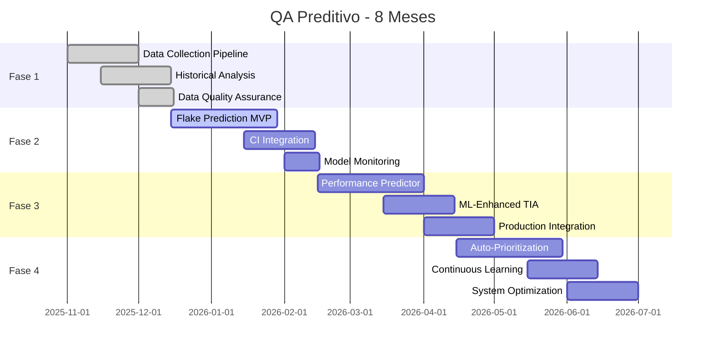

# 🔮 Predictive QA Roadmap - Próximo Nível de Maturidade

## 🎯 Visão Geral - QA Preditivo

**Status Atual:** Você tem controle total do presente (qualidade estável, automatizada, inteligente).
**Próximo Salto:** Prever o futuro - detectar riscos antes que virem falhas, otimizar preventivamente.

**Resultado Esperado:** QA que não apenas **detecta problemas**, mas os **previne**. De reativo para proativo.

---

## 🏗️ Arquitetura Técnica Proposta

### **Camadas do Sistema Preditivo**

```
┌─────────────────────────────────────────────────┐
│ 📊 DATA LAKE DE QUALIDADE                        │
│ • Histórico de execuções (3+ meses)             │
│ • Métricas de performance, flakes, cobertura    │
│ • Dados de produção (LCP, INP, erro rates)      │
└─────────────────────────────────────────────────┘
                          │
┌─────────────────────────────────────────────────┐
│ 🤖 MODELOS DE MACHINE LEARNING                   │
│ • Flake Prediction Model                        │
│ • Performance Regression Predictor              │
│ • Test Impact Analysis (TIA) ML                 │
└─────────────────────────────────────────────────┘
                          │
┌─────────────────────────────────────────────────┐
│ 🎯 SISTEMA DE ALERTAS PROATIVOS                 │
│ • Slack/Discord notifications                   │
│ • GitHub Issues automáticas                     │
│ • Dashboard de riscos                           │
└─────────────────────────────────────────────────┘
                          │
┌─────────────────────────────────────────────────┐
│ 🚀 INTEGRAÇÃO COM CI/CD                         │
│ • Gates inteligentes                            │
│ • Priorização automática de PRs                 │
│ • Otimização de pipelines                       │
└─────────────────────────────────────────────────┘
```

### **Stack Tecnológico Sugerido**

#### **Data & Analytics**

- **TimescaleDB/PostgreSQL** - Time-series para métricas históricas
- **Python + Pandas/Polars** - Análise e processamento de dados
- **MLflow** - Gestão de modelos e experimentos

#### **Machine Learning**

- **Scikit-learn** - Modelos tradicionais (Random Forest, Gradient Boosting)
- **LightGBM/XGBoost** - Para grandes volumes de dados
- **TensorFlow/PyTorch** - Para deep learning se necessário

#### **Infra & DevOps**

- **GitHub Actions** - Pipelines de ML
- **Docker** - Containerização de modelos
- **Redis** - Cache de predições

#### **Integração**

- **Webhooks** - Comunicação CI ↔ ML
- **APIs REST/GraphQL** - Exposição de predições
- **Grafana/Metabase** - Dashboards de risco

---

## 📅 Roadmap Detalhado - 6 Meses

### **Fase 1: Fundamentos (Meses 1-2) - "Data Lake de Qualidade"**

#### **Objetivo:** Coletar e estruturar dados históricos

#### **Entregáveis Técnicos:**

##### **1.1 Data Collection Pipeline**

```javascript
// scripts/collect-qa-data.mjs
class QADataCollector {
  async collectExecutionData(testResults, performanceMetrics) {
    // Coleta dados estruturados
    const dataPoint = {
      timestamp: new Date(),
      testSuite: testResults.suite,
      browser: testResults.browser,
      duration: testResults.duration,
      flakes: testResults.flakes,
      errors: testResults.errors,
      selectorsUsed: testResults.selectors,
      networkConditions: testResults.network,
      // + performance metrics
      p95: performanceMetrics.p95,
      lighthouseScore: performanceMetrics.lighthouse,
      bundleSize: performanceMetrics.bundle,
    };

    await this.storeDataPoint(dataPoint);
  }
}
```

**Features:**

- Hook em todos os testes para coleta automática
- Schema versionado para dados
- Compressão e retenção inteligente (dados antigos agregados)

##### **1.2 Historical Data Analysis**

```python
# scripts/analyze-qa-history.py
import pandas as pd
from sklearn.preprocessing import StandardScaler

class QADataAnalyzer:
    def analyze_flake_patterns(self, df):
        # Análise de padrões de flakes
        patterns = {
            'time_of_day': df.groupby(df.timestamp.dt.hour)['flakes'].mean(),
            'day_of_week': df.groupby(df.timestamp.dt.dayofweek)['flakes'].mean(),
            'recent_changes': self.correlate_with_git_changes(df),
            'network_conditions': df.groupby('network')['flakes'].mean()
        }
        return patterns

    def performance_trends(self, df):
        # Análise de tendências de performance
        trends = {
            'p95_trend': self.calculate_trend(df.p95),
            'lighthouse_trend': self.calculate_trend(df.lighthouse),
            'seasonal_patterns': self.detect_seasonality(df)
        }
        return trends
```

**Features:**

- Análise estatística de padrões
- Detecção de correlações (ex: mudanças de rede → mais flakes)
- Visualizações automáticas de tendências

##### **1.3 Data Quality Assurance**

- Validação automática de dados coletados
- Detecção de anomalias/outliers
- Data cleaning pipelines

#### **Métricas de Sucesso Fase 1:**

- ✅ **3+ meses de dados históricos** coletados
- ✅ **Data lake estruturado** com 100k+ pontos de dados
- ✅ **Análises básicas** identificando top 5 padrões de falhas
- ✅ **Dashboards exploratórios** para stakeholders

---

### **Fase 2: ML Básico (Meses 3-4) - "Flake Prediction MVP"**

#### **Objetivo:** Primeiro modelo preditivo funcional

#### **Entregáveis Técnicos:**

##### **2.1 Flake Prediction Model**

```python
# models/flake_predictor.py
import lightgbm as lgb
from sklearn.model_selection import train_test_split
from sklearn.metrics import accuracy_score, precision_recall_curve

class FlakePredictor:
    def __init__(self):
        self.model = lgb.LGBMClassifier(
            n_estimators=100,
            learning_rate=0.1,
            max_depth=6
        )

    def prepare_features(self, df):
        # Features para predição
        features = {
            'hour_of_day': df.timestamp.dt.hour,
            'day_of_week': df.timestamp.dt.dayofweek,
            'recent_flakes': self.calculate_recent_flake_rate(df, window=7),
            'test_complexity': self.calculate_test_complexity(df),
            'network_stability': df.network_stability,
            'code_coverage_change': df.coverage_change,
            'selectors_count': df.selectors_count,
            'async_operations': df.async_ops_count
        }
        return pd.DataFrame(features)

    def train(self, X, y):
        X_train, X_test, y_train, y_test = train_test_split(X, y, test_size=0.2)
        self.model.fit(X_train, y_train)

        # Avaliação
        y_pred = self.model.predict_proba(X_test)[:, 1]
        precision, recall, thresholds = precision_recall_curve(y_test, y_pred)

        return {
            'accuracy': accuracy_score(y_test, y_pred > 0.5),
            'feature_importance': dict(zip(X.columns, self.model.feature_importances_))
        }

    def predict_flake_probability(self, test_context):
        # Predição em tempo real
        features = self.prepare_features(pd.DataFrame([test_context]))
        return self.model.predict_proba(features)[0][1]
```

**Features do Modelo:**

- Hora do dia, dia da semana
- Taxa recente de flakes (janela móvel)
- Complexidade do teste (número de seletores, async ops)
- Estabilidade de rede
- Mudanças recentes no código
- Cobertura de testes

##### **2.2 CI Integration**

```javascript
// scripts/predictive-ci-guard.mjs
class PredictiveCIGuard {
  async evaluateTestSuite(testSuite) {
    const predictions = [];

    for (const test of testSuite) {
      const flakeProb = await this.flakePredictor.predict(test);
      const riskLevel = this.calculateRiskLevel(flakeProb);

      predictions.push({
        test: test.name,
        flakeProbability: flakeProb,
        riskLevel,
        recommendedAction: this.getRecommendedAction(riskLevel),
      });
    }

    return this.optimizeExecutionOrder(predictions);
  }

  calculateRiskLevel(probability) {
    if (probability > 0.7) return "high";
    if (probability > 0.4) return "medium";
    return "low";
  }

  optimizeExecutionOrder(predictions) {
    // Executa testes de baixo risco primeiro para feedback rápido
    return predictions.sort((a, b) => {
      const riskOrder = { low: 1, medium: 2, high: 3 };
      return riskOrder[a.riskLevel] - riskOrder[b.riskLevel];
    });
  }
}
```

**Features:**

- Predições em tempo real durante execução
- Reordenação inteligente de testes
- Alertas proativos para testes de alto risco

##### **2.3 Model Monitoring**

- Acurácia do modelo ao longo do tempo
- Drift detection (modelo envelhecendo?)
- Retraining automático baseado em novos dados

#### **Métricas de Sucesso Fase 2:**

- ✅ **Modelo com >80% accuracy** em predição de flakes
- ✅ **CI executando testes** na ordem otimizada
- ✅ **Alertas proativos** para testes de alto risco
- ✅ **Dashboard de performance** do modelo

---

### **Fase 3: ML Avançado (Meses 5-6) - "Performance & TIA Inteligente"**

#### **Objetivo:** Predições de performance e TIA com ML

#### **Entregáveis Técnicos:**

##### **3.1 Performance Regression Predictor**

```python
# models/performance_predictor.py
class PerformancePredictor:
    def predict_p95_regression(self, code_changes, historical_data):
        # Features: tamanho da mudança, arquivos críticos, complexidade
        features = self.extract_change_features(code_changes)

        # Modelo treinado com dados históricos de performance
        regression_prob = self.model.predict_proba(features)[0][1]

        return {
            probability: regression_prob,
            estimated_impact: self.estimate_p95_impact(regression_prob),
            confidence: self.calculate_prediction_confidence(features)
        }

    def extract_change_features(self, changes):
        return {
            'files_changed': len(changes),
            'critical_files': changes.filter(f => f.critical).length,
            'test_files': changes.filter(f => f.path.includes('test')).length,
            'complexity_score': self.calculate_code_complexity(changes),
            'historical_flakiness': self.get_historical_flakiness(changes)
        }
```

##### **3.2 ML-Enhanced TIA**

```python
# models/tia_ml_enhancer.py
class TIA_ML_Enhancer:
    def predict_test_impact(self, code_changes):
        # Modelo treinado para mapear mudanças → testes necessários
        predictions = []

        for change in code_changes:
            # Predição baseada em aprendizado histórico
            impacted_tests = self.model.predict(change.features)

            # Confiança da predição
            confidence = self.calculate_prediction_confidence(change, impacted_tests)

            predictions.append({
                test: impacted_tests,
                confidence,
                reasoning: self.generate_explanation(change, impacted_tests)
            })

        return this.optimize_test_selection(predictions);
```

##### **3.3 Real-Time Production Data Integration**

```javascript
// scripts/production-monitor.mjs
class ProductionMonitor {
  async collectRealTimeMetrics() {
    // Integração com RUM (Real User Monitoring)
    const realMetrics = await this.rumClient.getLatestMetrics();

    return {
      realLCP: realMetrics.lcp_p95,
      realINP: realMetrics.inp_p95,
      realCLS: realMetrics.cls_p95,
      errorRate: realMetrics.error_rate,
      userSatisfaction: realMetrics.satisfaction_score,
    };
  }

  correlateWithTestMetrics(testMetrics, realMetrics) {
    // Correlação entre métricas de teste e produção
    return {
      lcp_alignment: this.calculate_alignment(
        testMetrics.lighthouse_lcp,
        realMetrics.realLCP,
      ),
      reliability_correlation: this.correlate_error_rates(
        testMetrics.flakeRate,
        realMetrics.errorRate,
      ),
    };
  }
}
```

#### **Métricas de Sucesso Fase 3:**

- ✅ **Performance predictor** com >75% accuracy em regressões
- ✅ **TIA ML-enhanced** reduzindo falsos positivos em 50%
- ✅ **Dados de produção** integrados no pipeline
- ✅ **Correlações** entre teste/produção estabelecidas

---

### **Fase 4: Otimização & Scale (Meses 7-8) - "Sistema Autônomo"**

#### **Objetivo:** Sistema totalmente autônomo e escalável

#### **Entregáveis Técnicos:**

##### **4.1 Auto-Prioritization Engine**

```python
# models/prioritization_engine.py
class PrioritizationEngine:
    def prioritize_backlog(self, issues, current_context):
        # Modelo que prioriza baseado em:
        # - Impacto na qualidade
        # - Probabilidade de regressão
        # - Complexidade de implementação
        # - Valor de negócio

        scores = []
        for issue in issues:
            quality_impact = self.predict_quality_impact(issue)
            regression_risk = self.predict_regression_risk(issue)
            implementation_effort = self.estimate_effort(issue)
            business_value = self.assess_business_value(issue)

            priority_score = (quality_impact * 0.4) + (regression_risk * 0.3) + (business_value * 0.2) - (implementation_effort * 0.1)

            scores.append({
                issue: issue,
                score: priority_score,
                factors: {quality_impact, regression_risk, business_value, implementation_effort}
            })

        return scores.sort((a, b) => b.score - a.score);
```

##### **4.2 Continuous Learning Pipeline**

- Auto-retraining de modelos com novos dados
- A/B testing de diferentes abordagens de ML
- Feature engineering automatizado

---

## 📊 Métricas de Sucesso Globais

### **Métricas Técnicas**

- **Accuracy de Predição:** >80% para flakes, >75% para performance
- **Redução de Falsos Positivos:** 60% vs abordagem rule-based
- **Tempo de CI:** -50% com predições inteligentes
- **Lead Time de Qualidade:** De dias para horas

### **Métricas de Negócio**

- **Redução de Regressões em Produção:** 70%
- **Tempo de Feedback:** De 15min para 5min
- **Custo de QA:** -40% (menos retrabalho)
- **User Satisfaction:** +15% (menos bugs)

---

## 🛠️ Stack Tecnológico Detalhado

### **Infra de Dados**

```
TimescaleDB/PostgreSQL → Dados históricos
Redis → Cache de predições
MinIO/S3 → Artefatos de modelo
```

### **ML Pipeline**

```
Python 3.11 + Poetry
scikit-learn + LightGBM
MLflow → Experiment tracking
FastAPI → APIs de predição
```

### **Integração CI**

```
GitHub Actions + Self-hosted runners
Docker containers para isolamento
Webhooks para comunicação assíncrona
```

### **Monitoramento**

```
Grafana → Dashboards de risco
Prometheus → Métricas de modelo
AlertManager → Notificações inteligentes
```

---

## ⚠️ Riscos & Mitigações

### **Riscos Técnicos**

- **Data Quality:** Mitigação - validação automática + limpeza
- **Model Drift:** Mitigação - monitoramento contínuo + retraining
- **Performance de Predição:** Mitigação - cache inteligente + async processing

### **Riscos de Adoção**

- **Curva de Aprendizado:** Mitigação - treinamento gradual + documentação
- **Manutenção de Modelos:** Mitigação - pipelines automatizados
- **Dependência de Dados:** Mitigação - fallbacks para regras tradicionais

---

## 📈 Roadmap Visual



---

## 🚀 Como Começar Amanhã

### **Sprint 0 - Preparação (1 semana)**

1. **Instalar stack Python/ML** no ambiente
2. **Criar repositório** para modelos de ML
3. **Definir schema** inicial de dados
4. **Configurar MLflow** para experiment tracking

### **Sprint 1 - Data Foundation (2 semanas)**

1. **Implementar data collection** em todos os testes
2. **Criar pipeline** de ingestão para database
3. **Fazer análise exploratória** dos primeiros dados
4. **Definir features** para modelo inicial

### **Sprint 2 - Primeiro Modelo (2 semanas)**

1. **Treinar modelo baseline** de flakes
2. **Integrar predições** no CI (modo shadow)
3. **Comparar accuracy** com abordagem atual
4. **Ajustar features** baseado em resultados

---

## 🎯 Resultado Final Esperado

Em 8 meses, você terá:

✅ **QA verdadeiramente preditivo** - problemas detectados antes de acontecer
✅ **CI inteligente** - pipelines que se auto-otimizam
✅ **Qualidade escalável** - cresce com o negócio, não contra ele
✅ **Vantagem competitiva** - nível de maturidade raro no mercado

---

_Este roadmap transforma seu framework atual em um **sistema de IA para qualidade de software** - o próximo nível de excelência técnica._
